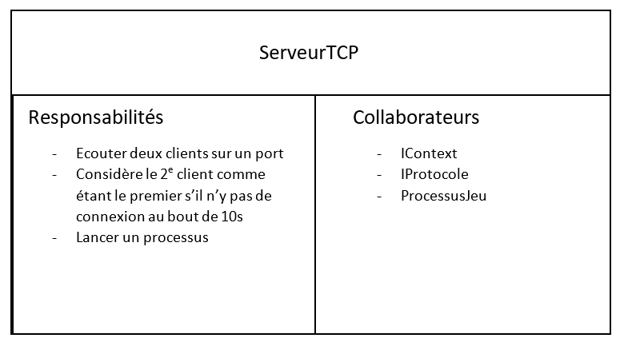

# Jeu d'échecs en réseau

Par Hadrien BONTEMPS et Alexandre KHA

## Introduction

Ce code s'inscrit dans le cadre du projet du cours de Conception Logicielle, présenté et encadré par M. Joël CHAMPEAU et M. Sylvain GUERIN.
L'objectif de ce projet est d'implémenter un jeu d'échecs en Langage JAVA tout en intégrant les principes SOLID et des patrons de conception (*Observer/Observable, Composant/Composite* et *Strategy*). Ce jeu devra permettre à deux utilisateurs de jouer une partie d'échecs sur leur machine respective, ce qui sera rendu possible par l'implantation du pattern *Client-Serveur TCP*.

Le jeu d'échecs est un jeu de plateau qui oppose deux joueurs. Chacun dispose de plusieurs pièces qui peuvent se mouvoir et capturer d'autre pièeces sur l'échiquier suivant des règles propres à chacune. Le but est de mater le roi adverse en l'empêchant de se protéger de nos pièces.

## User Stories

Afin de résumer l'objectif que l'on se donne avec ce projet, nous pourrions dire : \
"En tant qu'utilisateur, je souhaite pouvoir lancer une application afin de pouvoir jouer aux échecs avec un second utilisateur situé dans la même pièce."

Cette formulation appelle de nombreuses User Stories sous-jacentes :

- En tant que plateau, je souhaite pouvoir instancier des pièces afin de permettre mon initialisation et de présenter aux utilisateurs des méthodes pour interagir avec ces pièces.
- En tant que pièce, je souhaite pouvoir contenir suffisamment d'information (couleur, valeur, coordonnée) pour qu'un utilisateur puisse m'identifier.
- En tant qu'interface graphique, je souhaite représenter un échiquier et permettre à un utilisateur de déplacer une pièce par un drag & drop sur l'image correspondante.
- En tant que serveur, je souhaite permettre à deux utilisateurs d'être en mesure de se connecter en lançant l'application.
- En tant qu'application, je souhaite être en mesure de me connecter à la fois au serveur et à l'application lancée par le deuxième utilisateur, et de me tenir au fait des déplacements
  effectués par cet utilisateur afin de permettre à chaque utilisateur d'observer les coups joués par son adversaire en temps réel.

## Lancement de l'application

  L'application ne nécessite pas d'installations préalables, le support de l'interface graphique est la classe Application de javafx.
Elle a été testée sur Intellij, avec un SDK "java version 16".

  Le lancement de l'application se fait dans le package __LaunchSection__: 
- Il faut d'abord lancer le programme __MainServeur__, qui créé un serveur TCP écoutant 2 clients sur des sockets connectés à un port particulier (5000).
- On lance ensuite 2 fois à la suite le programme __ClientGUI__ qui initialise un client et son interface graphique dédiée. 
- Sur une seule machine (pour 2 interfaces graphiques), il est nécessaire __d'autoriser plusieurs instances de cette classe__, ce qui peut être fait en allant dans l'"Edit Configurations" de cette classe, "Modify options" et valider "Allow multiple options". 
Sur 2 machines différentes, il faudra modifier l'argument "host" de la Socket (dans ClientGUI) par __l'adresse IP (ipv4 sur le même réseau) du serveur__. Il peut être nécessaire de désactiver un pare-feu (par exemple celui de Windows) pour établir la connexion.
- Une fois cela fait, le premier client prend les pièces blanches et il commence la partie, tandis que le second prend les pièces noires et joue après ce dernier. 
- Le mouvement des pièces utilise le principe de Drag & Drop, il faut maintenir le click gauche sur la pièce à bouger et la lâcher sur la case voulue. Les cases disponibles sont indiquées avec des points au centre, ou par un cercle autour des pièces capturables. 
Si le roi est menacé, sa case est indiquée en rouge.
S'il y a situation de mat ou de pat (impossibilité pour l'un de jouer un coup légal), les joueurs en sont informés par un message dans le terminal et le plateau reprend son état initial. Il est possible d'y rejouer directement une partie, ou de la quitter en fermant l'interface grahique.
- Si seulement un client est connecté au serveur au bout de 10s, le jeu sera joué en local (toute la partie est jouée sur la machine du client).

## Composition du logiciel, diagrammes de classes

Ce projet se décompose en 5 packages qui correspondent chacun à un thème particulier (sans être indépendants par rapport aux autres) :
- __All_Pieces__, qui contient les classes correspondant aux pièces du jeu (Roi, Dame, Cavalier, Tour, Fou et Pion)
- __GameCommons__, qui contient les classes et interfaces relatives au plateau de jeu, qui met en place les règles et est capable de contrôler le bon déroulement du jeu 
- __GraphicalElements__, qui possède 2 applications du jeu avec IHM, pouvant être lancées en local (contre IA ou non). Elles servent de modèle au ClientGUI
- __Server__, dédié à la mise en place d'un serveur TCP, de protocoles et de Strategies
- __LaunchSection__, qui possède les "Main" pour lancer le serveur (MainServeur) et le client (ClientGUI). Ce client ne correspond pas au ClientTCP classique puisqu'il implante directement une IHM (responsabilité supplémentaire).

Les pièces héritent toutes d'une classe abstraite Piece, elles ont été conçues suivant le diagramme de classes suivant :
  

  
  
  
    Figure 1 : Diagramme de classes des Pieces
    
      
Le plateau Board implémente une interface riche, composée des méthodes de contrôle du jeu (vérifiant notamment les cases accessibles, le joueur actuel, l'état d'échec, de mat et de pat, réalisant des coups etc.). 
Le pattern Composant/Composite est utilisé afin de produire l'historique des coups effectués sur le plateau, ce qui est vu par la suite.
Le plateau est dépendant des Pieces puisqu'il les instancie dans un tableau, vu comme l'état de l'échiquier.
On a alors les diagrammes de classes du plateau suivants (le 2e montrant sa relation avec la classe Piece) :
  

  
  
  
    Figure 2 : Diagramme de classes du plateau (Board)
  
  
  
  
  
    Figure 3 : Dépendances entre Board et Piece
      
  
  L'implémentation du côté Serveur est globalement plus riche en classes, pour permettre de répondre aux principes notamment de responsabilité limitée, de généricité des objets et de la possibilité d'extensions.
  En effet le ServeurTCP est très général, il prend en paramètres un contexte (ici IGame, lié au jeu d'échecs), un protocole (ProtocoleJeu) qui spécifie le service qu'il va exécuter (en l'occurence lié au jeu d'échecs), écoute 2 clients sur un port et lance un processus (ProcessusJeu). Ce processus consiste a exécuter le protocole du serveur.
  Finalement, ce protocole effectue des actions dépendamment des stratégies (mode de jeu en réseau ou sur une machine) de la classe Game (implémentant le contexte IGame). 
  Game, qui a la responsabilité d'exécuter une stratégie (objet Strategy pris en paramètre, éventuellement "seté" par la suite), est la classe qui instancie le Serveur TCP et le lance.
    
  
  
  
  
    Figure 4 : Dépendances côté Serveur
      
  
  Finalement, le client (ClientGUI) dépend de la classe Board (utilisée pour dessiner le plateau) et de la classe Piece puisque l'IHM suit les pièces déplacées par les joueurs pour les dessiner sur le plateau.
  En réalité, le client a une dépendance tacite supplémentaire avec le serveur avec lequel il est connecté (par l'intermédiaire d'un Socket). 
  On pourra regretter le fait que le client ait 2 responsabilités disjointes (se connecter au serveur et produire une IHM), et que l'implantation d'un nouveau protocole induise des modifications dans le code du ClientGUI (contraire au principe O) afin de s'y adapter. En effet le client reçoit des messages du serveur différents lorsqu'il joue en réseau ou en local et modifie son comportement pour s'y adapter (ex : if(localMode) {...} else {...}).
  Les dépendances du client sont les suivantes :
    
  
  
  

    Figure 5 : Dépendances du ClientGUI
    
    
## Cartes CRC

Dans la continuité des diagrammes de classes, nous présentons les cartes CRC (Classes, Responsabilités et Collaborateurs) des classes principales :

    Figure 6 : Carte CRC de Board

    Figure 7 : Carte CRC de ClientGUI

    Figure 8 : Carte CRC de ServeurTCP

    Figure 9 : Carte CRC de Game

## Design patterns

Outre le pattern __Client - Serveur TCP__ précédemment vu, le logiciel implante 3 autres patterns.
  
Le premier est le patron __Observer/Observable__, réalisable grâce à l'API Java *PropertyChangeSupport/PropertyChangeListener*.
Le support du pattern (*l'Observable*) est le plateau (*Board*), qui notifie un *Observer* lorsqu'il y a mat ou pat (donc par un *firePropertChange* dans les méthodes *mate()* et *stalemate()*). Son *Observer* est *ClientGUI*, qui réagit à ces 2 notifications en printant le résultat de la partie (qui a gagné, ou égalité) et en redessinant un nouveau plateau où l'on peut éventuellement rejouer mais que l'on peut également quitter.
Ce pattern pourrait être utilisé pour notifier d'autres évènements (notamment l'échec ou la promotion).  
  
  Un deuxième pattern implanté est le pattern __Strategy__, qui consiste à dériver une action générale en actions plus spécifiques.
  Nous choisissons de réaliser ce pattern pour spécifier 2 modes de jeu : le jeu en réseau, par la classe *ModeJeuClassique*; et le jeu en local, par la classe *ModeJeuLocal*. Ces classes implémentent *IModeJeu*, et décrivent dans leur méthode héritée *jouer()* les instructions respectives à envoyer au client, pour lui permettre de jouer dans le mode souhaité. *Game* prend initialement en variable d'instance un objet *ModeJeuClassique*, mais le protocole du serveur la change en *ModeJeuLocal* s'il se trouve qu'une seule connexion a été détectée par le jeu.
    
  Le dernier pattern implanté est le pattern __Composant/Composite__, utilisé pour construire un historique des coups d'une partie. L'interface *History* décrit une unique méthode *addMove(args)* qui permet d'ajouter un coup à l'historique lorsqu'il est joué. Cette interface est implémentée par la classe *Records* qui joue le rôle de composite. Enfin cette classe *Records* est instanciée dans *Board* et sa variable *records* est attribuée à *Board.records* et joue le rôle de feuille.  

## Tests

Des tests unitaires ont été effectués uniquement sur les méthodes de contrôle du plateau. En effet, garantir qu'un coup spécifié est effectivement joué, qu'un déplacement est légal ou qu'un joueur a gagné est la priorité de l'application.
Des scénarii de simulation (situation de mat, possibilité de roque etc.) ont été utilisés dans des tests générés manuellement dans la classe *Test_Board_Methods* du package GameCommons. Toutes les méthodes n'ont pas été testées, mais les méthodes principales (*check()*, *mate()*, *reachable_squares()*) sont couvertes : sur 16 méthodes de la classe *Board*, 11 ont été testées et toutes ces méthodes sont validées.

## Futures améliorations

Un mode de jeu avec une intelligence artificielle (Negamax) était initialement prévu, et il est possible de jouer en local contre une première version de cette IA (implémentée dans *Engine*) en lançant *AppEngine*.
Pour implémenter ce mode de jeu dans l'application avec Client-Serveur TCP, on pourrait créer une nouvelle stratégie *ModeJeuIA* tout comme *ModeJeuClassique* et *ModeJeuLocal*, et spécifier la réponse de *ClientGUI* à ce nouveau mode de jeu. Il faudrait également permettre à l'utilisateur de choisir entre les différents modes de jeu sans forcément attendre, notamment par un système de boutons.

## Mentions spéciales

*Merci à Alexis MOTET et Gabriel GUEGANNO pour leur aide cruciale au cours de ce projet, notamment pour la partie Serveur et IHM. Au final nous avons même pu jouer ensemble, malgré nos IHM différentes.*

  
